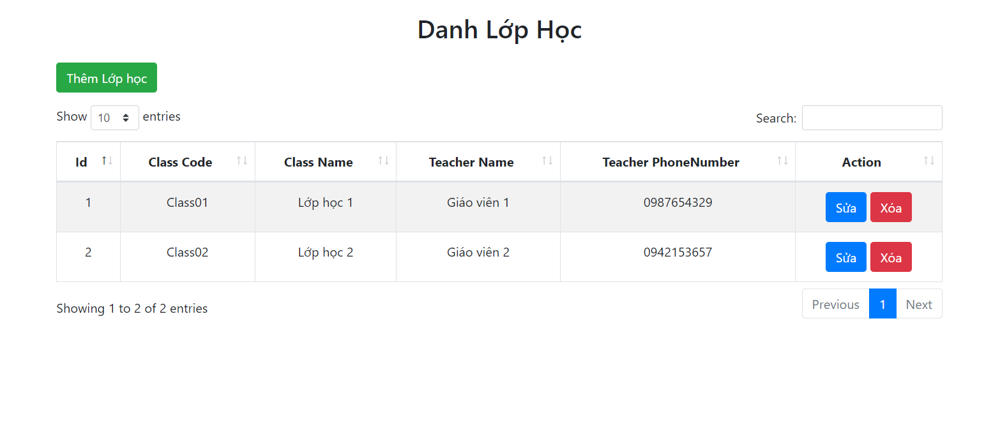
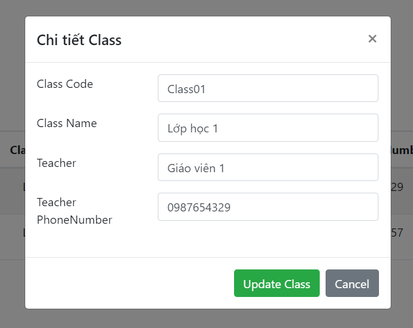

## Các bước chạy trương trình 
1. tạo table tên class_db1 trên mySQL
2. import dữ liệu class_db ở folder dumDB
3. chạy java Spring tại back-end
4. Mở CRUD tại front-end
## các chức năng CRUD
1. chức năg CRUD Classroom

2.chức năng sửa

3.Chức năng xóa, khi xóa có hiển thị thông báo confirm

